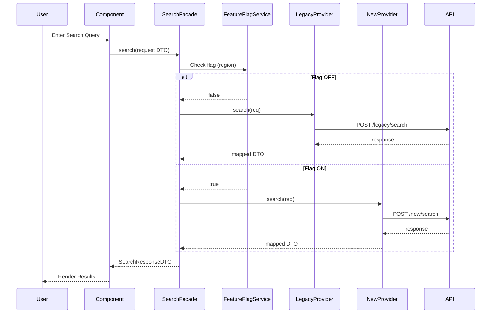

# SearchFacade 

The original plan smelled… slow.

Not broken. Not reckless. Just **inefficient in a very expensive way**.

The business goal was clear: migrate a subset of global websites—starting with North America—to a new internal search provider. The proposed execution? Retrofit each Angular application individually to call new endpoints. One by one. Over a quarter.

On paper, it looked safe.

In practice, it was **death by a thousand cuts**.

Each Angular app would:

-   Implement its own HTTP integration
-   Handle its own edge cases
-   Duplicate mapping logic
-   Own its own rollback story

That’s not a migration plan. That’s **distributed risk**.

> **When change is scattered across clients, failure becomes unpredictable.**

There was no seam. No control point. No way to introduce change safely.

So we reframed the problem:

> _Don’t migrate apps. Migrate the **search contract**._

----------

## System Architecture & Identity Logic

The solution anchored around a simple idea:

> **Stabilize the interface. Isolate the variability.**

In Angular, that meant introducing a **Facade layer**—a clean service that every component talks to, regardless of which search engine is active.

----------

### Step 1: Introduce the Search Facade

We created a single entry point:

export  interface  SearchProvider {  
 search(request: SearchRequestDTO): Observable<SearchResponseDTO>;  
}

Then wrapped it in an Angular service:

@Injectable({ providedIn: 'root' })  
export  class  SearchFacade {  
 constructor(  
  private  legacy: LegacySearchProvider,  
  private  modern: NewSearchProvider,  
  private  flags: FeatureFlagService  
 ) {}  
  
 search(request: SearchRequestDTO): Observable<SearchResponseDTO> {  
  if (this.flags.isEnabled('new-search', request.region)) {  
  return  this.modern.search(request);  
 }  
  return  this.legacy.search(request);  
 }  
}

Every Angular component now depends on **one thing only**:

this.searchFacade.search(request)

That’s it.

> **Components don’t choose providers. They consume behavior.**

----------

### Step 2: DTO-First Design

Before touching the new provider, we defined **strict DTO contracts**.

export  interface  SearchRequestDTO {  
 query: string;  
 filters: FilterDTO[];  
 pagination: PaginationDTO;  
 region: string;  
}  
  
export  interface  SearchResponseDTO {  
 results: ProductDTO[];  
 total: number;  
}

These DTOs:

-   Mirror the legacy system (for stability)
-   Are flexible enough to support the new provider
-   Act as the **single source of truth**

> **The DTO is the boundary. Everything else is an implementation detail.**

----------

### Step 3: Provider Implementations (Angular Services)

Each provider became its own Angular service.

#### Legacy Provider

@Injectable({ providedIn: 'root' })  
export  class  LegacySearchProvider  implements  SearchProvider {  
 constructor(private  http: HttpClient) {}  
  
 search(req: SearchRequestDTO): Observable<SearchResponseDTO> {  
  const  payload  =  mapToLegacy(req);  
  return  this.http.post('/legacy/search', payload).pipe(  
  map(mapFromLegacy)  
 );  
 }  
}

#### New Provider

@Injectable({ providedIn: 'root' })  
export  class  NewSearchProvider  implements  SearchProvider {  
 constructor(private  http: HttpClient) {}  
  
 search(req: SearchRequestDTO): Observable<SearchResponseDTO> {  
  const  payload  =  mapToNew(req);  
  return  this.http.post('/new/search', payload).pipe(  
  map(mapFromNew)  
 );  
 }  
}

Each provider owns:

-   Its API contract
-   Its mapping logic
-   Its failure handling

> **We isolate complexity instead of sharing it.**

----------

### Step 4: Feature Flag Routing

The real power came from **runtime control**.

We introduced a feature flag service:

@Injectable({ providedIn: 'root' })  
export  class  FeatureFlagService {  
 isEnabled(flag: string, region: string): boolean {  
  // Config-driven (env, API, or remote config)  
  return  this.flags[flag]?.includes(region);  
 }  
}

Now we can:

-   Enable new search for **US only**
-   Expand to **Canada**
-   Roll back instantly if something breaks

No redeploy. No code change.

> **Deployment is not release. Control lives at runtime.**

----------

### Step 5: Testing Strategy (Selenium + Contract Confidence)

We didn’t trust assumptions. We validated behavior.

Using **Selenium (.NET)**:

-   Verified UI consistency between providers
-   Ran regression suites against both implementations
-   Ensured identical user experience regardless of backend

This gave us:

-   Confidence in DTO mappings
-   Safety in toggling providers
-   Reduced manual QA overhead

> **If two systems claim to be identical, tests are the judge.**

----------

### Step 6: Deployment & CI/CD (Azure DevOps)

All changes flowed through **Azure DevOps pipelines**:

-   Build Angular app
-   Run unit + Selenium tests
-   Deploy to staged environments

Feature flags allowed us to:

-   Deploy code safely ahead of release
-   Gradually enable functionality
-   Monitor behavior before full rollout

> **Ship dark. Turn on light when ready.**

----------

## The Mermaid Logic

Here’s how a request flows through the Angular application:

Clean. Predictable. Replaceable.

----------

## Strategic Honesties (The Trade-offs)

### The Road Not Taken

We could have:

-   Updated each Angular app individually
-   Pointed components directly to new endpoints
-   Managed rollout per application

We didn’t.

Because:

> **Tight coupling today becomes technical debt tomorrow.**

That path would have:

-   Fragmented logic across apps
-   Made rollback painful
-   Increased long-term maintenance cost

We chose **centralized control over short-term simplicity**.

----------

### The Debt We Accepted

We accepted **duplicate mapping logic**:

-   `mapToLegacy` vs `mapToNew`
-   `mapFromLegacy` vs `mapFromNew`

This creates:

-   Extra maintenance overhead
-   Potential drift between providers

But:

> **Duplication in the right place is cheaper than the wrong abstraction.**

If this grows, we’d explore:

-   Shared schema validation
-   Code generation for mappings

----------

## The Homelab-to-Enterprise Bridge

This wasn’t just a frontend refactor. It followed **enterprise-grade practices**.

----------

### CI/CD Discipline

-   Azure DevOps pipelines
-   Automated testing gates
-   Safe deployments with feature flags

----------

### Observability

-   Measured response times per provider
-   Monitored error rates during rollout
-   Compared performance between systems

----------

### Reliability Patterns

-   Graceful fallback via flags
-   Consistent DTO contracts
-   Idempotent search requests

----------

### Scalable Frontend Design

Angular architecture followed:

-   **Service-driven design** (thin components)
-   **Single responsibility per provider**
-   **Facade pattern for orchestration**

> **Good frontend architecture is about control, not just rendering.**

----------

## The Appendix (Plain English Glossary)

**Facade**  
Like a receptionist at a hotel. You talk to one person, and they handle everything behind the scenes.

**DTO (Data Transfer Object)**  
A standard form. No matter who fills it out, it always looks the same.

**Feature Flag**  
A light switch. You can turn features on or off without changing the wiring.

**Latency**  
How long something takes to respond. Like waiting for a webpage to load.

**CI/CD**  
An automated assembly line that builds, tests, and ships code.

**Mapping**  
Translating data from one format to another. Like converting currencies.

**Contract (API Contract)**  
An agreement on how systems communicate—like a menu you can rely on.

**Rollback**  
Undoing a change when something goes wrong.

**Selenium**  
A robot that tests your website by clicking and typing like a real user.

**Angular Service**  
A reusable piece of logic shared across your app—like a utility worker behind the scenes.

----------

> **“We didn’t just migrate search—we built a system that makes change safe.”**