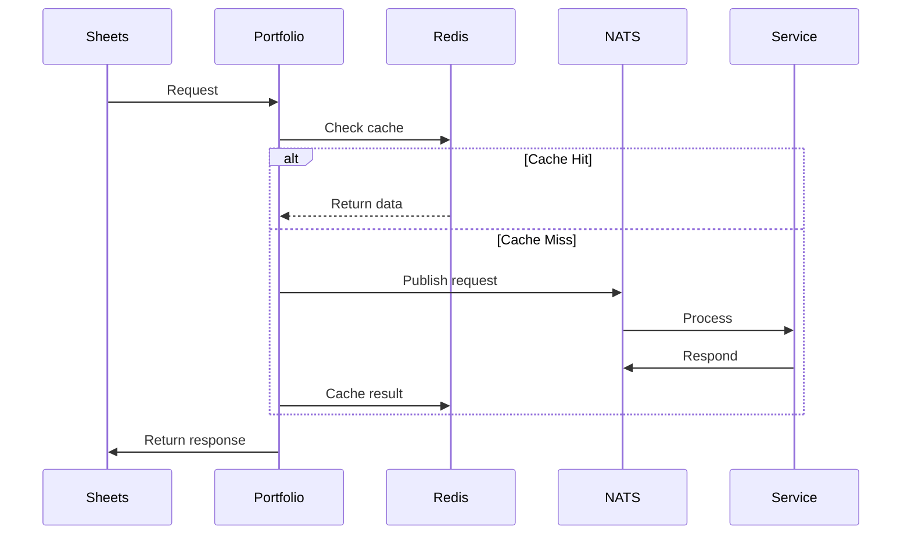

# Event-Driven Stock Intelligence Platform (Homelab to Cloud)

## The Catalyst

This didn’t start as architecture.

It started as a tool I wanted for myself.

I needed:

- A way to pull stock data into **Google Sheets**
- A way to stay informed via RSS

So I built a simple API using **ASP.NET Core**.

It worked. Clean. Fast. Done.

Until it wasn’t.

The system didn’t fail—it **drifted**.

- More endpoints
- More exposure
- More duplicated logic
- Less clarity about ownership

The real issue became obvious over time:

> **There was no system enforcing boundaries—only code responding to needs.**

That’s when I stopped thinking like a developer.

And started thinking like an architect.

----------

## System Architecture & Identity Logic

The system today is built on a simple rule:

> **Everything is private. Everything is event-driven. Nothing talks directly.**

At the center:

> **`portfolio` — my Go-based orchestrator**

----------

### Entry Layer — Sheets as Source and Interface

**Google Sheets** is both:

- The source of truth
- The UI

Sheets → portfolio (Go)

Sheets has no awareness of:

- Services
- Messaging
- Infrastructure

It asks one question:

> “What’s my portfolio right now?”

Everything else is abstracted.

----------

### Orchestration Layer — `portfolio` (Go)

Built in **Go**, compiled statically into a native binary.

Responsibilities:

- Accept inbound requests
- Translate to events
- Publish via **NATS**
- Aggregate responses
- Return structured data

This is the **control plane**.

Where I enforce:

- DTO discipline
- Contract boundaries
- Data consistency

----------

### Messaging Backbone — NATS (Leaf Architecture)

All communication runs through NATS:

[ Homelab ] ←→ [ NATS Leaf ] ←→ [ NATS Core ] ←→ [ Oracle Cloud ]

No service-to-service HTTP.

No tight coupling.

----------

### Identity & Security Model

Security is enforced at every layer:

- 128-character shared secret
- IP allowlists
- Mutual TLS
- Weekly cert rotation via CI/CD

If identity fails:

> **The system disconnects—no fallback paths.**

----------

## Data Layer — Purpose-Driven Storage

This is where the system became **intentional**.

----------

### Redis — Short-Term, Regeneratable State

Using **Redis** for:

- Lightweight contracts
- Cached stock data
- Intermediate computations
- Fast lookups

Rule:

> **If it’s cheap to regenerate, it belongs in Redis.**

----------

### SQLite — Durable, Long-Term Storage

Using **SQLite** for:

- Historical tracking
- Structured datasets
- Persistent state

Rule:

> **If it matters tomorrow, it gets persisted.**

----------

### Why This Split Works

- Redis = speed
- SQLite = durability

> **Different data, different responsibilities.**

----------

## Real System Flows

----------

### Flow 1 — Real-Time Portfolio Data

Sheets → portfolio → Redis → NATS → NATS → StockAPI → portfolio → Sheets

- Cache-first lookup
- Fallback to event-driven fetch
- Response aggregation

----------

### Flow 2 — Intelligence Pipeline

Sheets → portfolio → NATS → StockRSS (.NET)  
 → StockAI → CRON → EmailService

- RSS ingestion
- LLM filtering
- Daily execution

----------

### Flow 3 — Trading Signals

Sheets → portfolio → NATS → StocksApp (.NET)  
 → CRON → EmailService

- Nightly processing
- Sell signals
- Heatmaps

----------

## Reliability & Failure Strategy

This system is intentionally **pull-only**.

That decision simplifies everything.

----------

### Retry Logic

- Built into services + cron jobs
- Max **3 retries**

Why it works:

- No external state mutation
- Idempotent operations
- Safe repetition

> **Retries are safe because nothing is being changed—only observed.**

----------

### Failure Handling

If something fails:

- Logged
- Traced
- Notified

System continues operating.

----------

## Observability, Monitoring & Notifications

This is where the system becomes **production-grade**.

----------

### OpenTelemetry — Deep Visibility

Using **OpenTelemetry**:

- Distributed tracing
- Exception tracking
- Context propagation

----------

### Error Transport via NATS

Errors are first-class events:

Service → NATS → Error Channel → Consumers

- Secure transport
- Centralized visibility
- Decoupled handling

----------

### Metrics & Alerts — Grafana

Using **Grafana**:

- Resource monitoring
- Threshold alerts
- System health

----------

### Endpoint & Service Monitoring — Uptime Kuma

Using **Uptime Kuma**:

- External endpoint checks
- Internal service checks
- **NATS endpoint monitoring**

Detection time:

> **< 1 minute to identify failures**

This closes a critical gap:

- Metrics tell me _how_ things are behaving
- Kuma tells me _if they’re alive_

----------

### Notifications — Real-Time Feedback

- Grafana → infrastructure alerts
- **Gotify** → app-level errors

> **If anything breaks, I know immediately.**

----------

## Native Execution & Container Strategy

All services execute as **native machine code**:

- **Go** → static
- **Bun** → compiled native
- **.NET** → JIT → native

Containers:

- **Alpine Linux**
- Distroless
- Scratch

> **Only the binary ships. Nothing else exists.**

----------

## DevOps & Automation

----------

### CI/CD

Using **GitLab**:

- Native builds per commit
- Container pipelines
- Cert rotation automation
- Deployment pipelines

----------

### Infrastructure as Code

Using **Ansible**:

- Server provisioning
- Cron jobs
- System updates

----------

## The Mermaid Logic

----------

## Strategic Honesties (Trade-offs)

### No Kubernetes

I chose not to use Kubernetes.

Because:

- Adds complexity
- Reduces clarity
- Not needed at this scale

> **I optimize for understanding, not abstraction.**

----------

### Controlled Technical Debt

Remaining **.NET** services:

- StockRSS
- StocksApp

They are stable, isolated, and not worth rewriting yet.

----------

## The Homelab-to-Enterprise Bridge

This is where this project matters.

This is not “just a homelab.”

This is:

> **Enterprise architecture principles, intentionally applied at small scale**

- Event-driven messaging (NATS)
- Dual-layer data strategy (Redis + SQLite)
- Observability (OpenTelemetry)
- Monitoring (Grafana + Uptime Kuma)
- Real-time notifications (Gotify)
- CI/CD automation
- Infrastructure as Code
- Zero-trust networking

The only thing missing is Kubernetes.

And that’s intentional.

----------

## The Appendix (Plain English Glossary)

**Redis**  
Fast temporary storage—like a sticky note.

**SQLite**  
A simple file-based database—like a notebook.

**Event-Driven**  
Systems react when something happens.

**OpenTelemetry**  
A way to track what your system is doing.

**Retry Logic**  
Trying again automatically if something fails.

**Uptime Monitoring**  
Checking if something is alive—like a heartbeat monitor.
