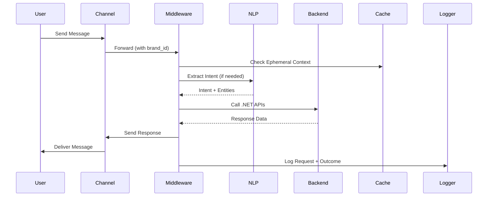

# Headless Multi-Channel Orchestration

## The Catalyst: The Smell of the App Store

There was a pattern. And it wasn’t a good one.

Every time the business wanted to reach users in a new channel—SMS, Facebook, Twitter—the answer was the same:

> “We need to build another app.”

Different platform. Same logic. Same backend calls. Same bugs—copied and pasted.

This is the kind of duplication that **rots a system from the inside out**.

- Multiple mobile apps.
- Multiple authentication paths.
- Multiple release cycles.
- Zero shared intelligence.

Worse, customers didn’t want another app. They already had one:

- Their messaging apps
- Their SMS inbox
- Their social platforms

The friction was obvious. The waste was obvious.

The real question was simple:

> **Why are we forcing users to come to us, instead of meeting them where they already are?**

So we stopped thinking in terms of “applications.”

We started thinking in terms of **interfaces over existing networks**.

No installs.  
No app store approvals.  
No duplication.

Just a single system that could **speak many languages across many channels**.

----------

## System Architecture & Identity Logic

### The Core Idea: Thin Channels, Thick Middleware

We treated every external platform as a **dumb pipe**.

SMS. Facebook. Twitter. Web chat.

They all do one thing well:

> Deliver a message.

Everything else belongs in one place:

> **The orchestration layer.**

----------

### High-Level Flow

1. A user sends a message from any platform.
2. The connector forwards it to our middleware.
3. Middleware normalizes the request.
4. Intent is extracted.
5. Backend APIs are orchestrated.
6. A response is composed and returned through the same channel.

No channel owns logic.  
No channel owns state.

That’s the rule.

----------

### Multi-Tenant Brand Injection

This system wasn’t single-purpose. It supported **multiple brands**.

We didn’t fork the system. We parameterized it.

Each incoming request carried a **`brand_id`**, injected at the connector level.

{  
 "brand_id": "brand_alpha",  
 "channel": "sms",  
 "message": "check order 12345"  
}

From that point forward, every decision flowed through that identifier:

- Routing rules
- API endpoints
- Response tone and formatting
- Feature flags

This is a classic **multi-tenant pattern**.

> **Same engine. Different personalities.**

Each brand had its own bot interface, but they all terminated into the same middleware spine.

----------

### Identity: Intentionally Deferred

Here’s where discipline matters.

We did **not** build a full identity system.

Not because we couldn’t.

Because we chose not to.

During the hackathon, identity was reduced to a single concept:

> **An order number is truth.**

If a user wanted to reference a transaction:

"Check order 12345"

That ID became the lookup key.

----------

### Why This Matters

We avoided premature complexity.

No cross-platform identity stitching.  
No OAuth flows.  
No account linking.

Instead, we defined the **future shape**:

- Phone number → user profile
- Social login → unified identity
- Internal profile → transaction history

But we didn’t build it yet.

> **We built the seam, not the system.**

----------

### DTO-Driven Middleware

Every request was normalized into a **Data Transfer Object (DTO)**.

This is where chaos becomes structure.

type  NormalizedRequest  = {  
 brandId: string;  
 channel: "sms"  |  "facebook"  |  "twitter";  
 userInput: string;  
 correlationId: string;  
};

From here:

1. DTO is passed to NLP service
2. NLP returns structured intent
3. Middleware orchestrates backend calls

----------

### Intent Resolution Pipeline

We used a hybrid model:

#### Fast Path (Regex Short-Circuit)

For high-confidence inputs:

if (/^yes|confirm$/i.test(input)) {  
  return  ConfirmIntent;  
}

No NLP call.  
No latency tax.

#### NLP Path

Everything else flowed through intent extraction.

{  
 "intent": "ORDER_LOOKUP",  
 "entities": {  
 "order_id": "12345"  
 }  
}

Middleware then mapped intent → handler.

----------

### Orchestration Layer (Node.js)

This is where the system earns its keep.

Responsibilities:

- Validate DTOs
- Route intents
- Call .NET backend APIs
- Compose responses
- Handle failure gracefully

We followed a **controller → service → client** pattern:

Controller  
 → Intent Service  
 → Backend Client (.NET APIs)

Clean boundaries. No leakage.

----------

### State: Minimal by Design

There was **no cross-platform session state**.

Let’s be clear:

> A conversation on SMS is not the same as a conversation on Facebook.

We did not pretend otherwise.

State only existed in two places:

1. **Ephemeral in-memory cache** (per interaction window)
2. **Persistent backend systems** (after transaction creation)

Once a transaction existed, it could be accessed anywhere—  
but only via explicit lookup (order ID).

> **Stateless by default. Stateful by exception.**

----------

### Failure Handling: Quiet, Logged, Controlled

When things broke—and they did—we chose:

> **Silent fallback + aggressive logging**

User sees:

> “Sorry, I didn’t catch that. Try again.”

System records:

- Full request payload
- Intent resolution attempt
- Backend response (or failure)

No stack traces leaking.  
No broken UX.

----------

## The Mermaid Logic: Request Lifecycle

## Strategic Honesties (The Trade-offs)

### Path Not Taken: Event-Driven Architecture

We could have introduced a message bus.

Kafka. Pub/Sub. Full async pipelines.

We didn’t.

Why?

Because this was a **speed problem**, not a scale problem.

> **You don’t bring a freight train to test a bicycle.**

Synchronous orchestration gave us:

- Faster iteration
- Easier debugging
- Lower cognitive load

----------

### Accepted Debt: In-Memory State

We used in-memory caching.

Not distributed. Not durable.

That means:

- State could be lost
- Horizontal scaling was limited

We knew this.

And we accepted it.

Because the goal was:

> **Prove the model works across channels.**

Not build a production-grade cache layer.

----------

## The Homelab-to-Enterprise Bridge

Even in a hackathon, we wrote like this would scale.

### Clean Separation of Concerns

- Node.js → orchestration
- .NET → business logic
- Connectors → transport only

### Observability Mindset

We didn’t have full Prometheus, but we behaved like we would:

- Structured logs
- Correlation IDs
- Traceable flows

### CI/CD Ready Structure

The repo was shaped for:

- Independent deployment
- Cross-platform builds
- Service isolation

### Replaceable Components

Every piece could be swapped:

- NLP engine
- Channel connectors
- Backend APIs

> **Loose coupling is a feature, not an accident.**

----------

## Outcome

- Eliminated need for dedicated mobile apps
- Reduced channel expansion from months → days
- Proved multi-brand orchestration viability
- Established a reusable architectural pattern

This wasn’t just a prototype.

It was a **directional shift**.

----------

## The Appendix (Plain English Glossary)

**DTO (Data Transfer Object)**  
A structured package of data. Like a labeled box instead of a pile of loose items.

**Middleware**  
The middle layer. It connects what users say to what systems do.

**Orchestration**  
Like a conductor in an orchestra. It tells different systems when to play their part.

**Latency**  
How long something takes. Lower latency = faster response.

**Multi-Tenant**  
One system serving multiple customers (brands), each isolated logically.

**NLP (Natural Language Processing)**  
Software that turns human language into structured meaning.

**Regex**  
Pattern matching for text. Like recognizing “yes” or “no” instantly.

**Stateless**  
The system doesn’t remember past interactions unless told explicitly.

**Stateful**  
The system remembers what happened before.

**CI/CD**  
Automated pipelines to build, test, and deploy software quickly.

**Correlation ID**  
A tracking number for a request as it moves through the system.