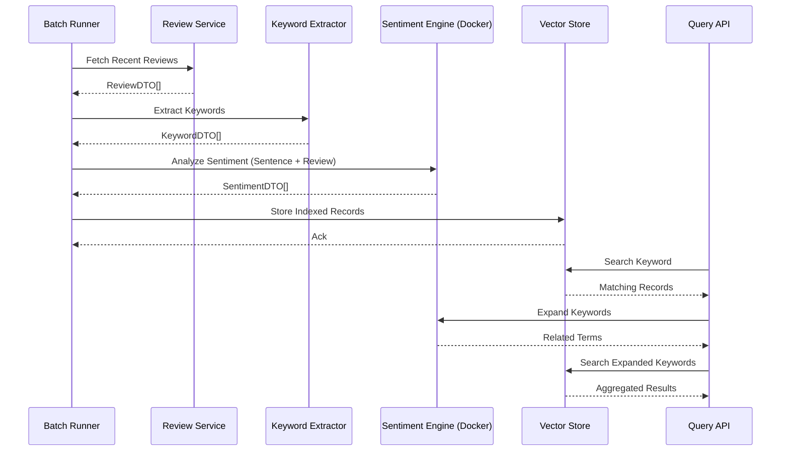

# ReviewMind -  Mining Meaning from Customer Chaos

## The Catalyst

The system wasn’t broken.

It was worse.

It was **wasteful**.

Years of customer reviews. Gigabytes of raw sentiment. Real users telling us exactly what worked and what didn’t. And yet… none of it was usable. It just sat there—buried in text blobs, disconnected, unindexed, and effectively invisible.

That’s the smell.

Not bad data. Not missing data.

**Ignored data.**

Search was primitive. You could keyword match, sure. But that’s not insight—that’s string matching. A user could write:

> “I love the product overall, but the battery life is terrible.”

And the system would happily categorize that as “positive” because of the word _love_. Meanwhile, the actual business problem—battery life—was quietly bleeding customer satisfaction.

This is where the frustration peaked.

We weren’t lacking information. We were lacking **structure**.

The hackathon question became simple:

> _How do you turn unstructured opinion into structured intelligence?_

No LLMs. No modern embeddings APIs. Just raw engineering discipline and a willingness to stitch together the right primitives.

----------

## System Architecture & Identity Logic

This system was designed with one core principle:

> **Every component is replaceable. No component is sacred.**

That principle drove everything.

### High-Level Flow

A nightly batch job orchestrated the pipeline:

/cmd/batch-runner  
 ├── ReviewIngestService  
 ├── KeywordExtractionService  
 ├── SentimentAnalysisService  
 ├── VectorStorageService  
 └── QueryAPI (read-side)

Each stage communicated via **DTOs (Data Transfer Objects)**.

No shared models. No tight coupling. Just contracts.

----------

### Step 1: Review Ingestion

We pulled reviews grouped by product.

type  ReviewDTO  struct {  
 ProductID string  
 ReviewID string  
 Content string  
 Rating int  
 Timestamp time.Time  
}

This was intentionally **dumb and pure**.

No logic. No transformation.

>  _Data structures should be transparent. Behavior belongs elsewhere._

----------

### Step 2: Keyword Extraction

We ran each review through a keyword extraction engine.

Output:

type  KeywordDTO  struct {  
 ReviewID string  
 Keywords []string  
}

This was not just frequency-based extraction. It leveraged an academic NLP model that understood contextual relevance.

Key decision:

> Extract keywords once. Reuse them everywhere.

No reprocessing during queries. Compute early. Cache forever.

----------

### Step 3: Sentiment Analysis (Dual-Layer)

This is where the system got interesting.

We didn’t just analyze the review.

We analyzed **the sentence containing the keyword**.

#### Why?

Because sentiment is **contextual**.

Example:

> “Great design, but the battery life is awful.”

-   Overall sentiment: mildly positive
-   Keyword: _battery life_
-   Sentence sentiment: negative

We captured both:

type  SentimentDTO  struct {  
 ReviewID string  
 Keyword string  
 SentenceScore float64  
 ReviewScore float64  
 WeightedScore float64  
}

The weighting formula:

WeightedScore = (SentenceScore * 0.7) + (ReviewScore * 0.3)

This bias ensured that **local context beats global tone**.

> **Insight:** Users complain in sentences, not paragraphs.

----------

### Step 4: Vector Storage (Primitive but Effective)

This wasn’t a modern vector DB.

It was… scrappy.

But it worked.

We stored:

-   Keywords
-   Product associations
-   Sentiment scores

Indexed in a way that allowed similarity queries.

type  VectorRecord  struct {  
 ProductID string  
 Keyword string  
 Score float64  
}

The “vector” aspect was rudimentary—more like a multi-dimensional index than cosine similarity—but it enabled:

-   Keyword proximity
-   Sentiment clustering
-   Fast lookup

And most importantly:

> **It created a queryable semantic layer where none existed before.**

----------

### Step 5: Query Engine (The Hidden Gem)

Search wasn’t just search.

It was **expansion**.

User input:

"battery"

System behavior:

1.  Find keyword
2.  Expand into 5 related keywords
3.  Aggregate results across all

Example expansion:

battery → [battery life, power, charging, longevity, drain]

This came from the same NLP engine used earlier.

> **Consistency matters. One brain. Multiple uses.**

Result:

-   Broader coverage
-   Better recall
-   More meaningful insights

----------

### Loose Coupling via DTOs

Every service consumed and produced DTOs.

This allowed:

-   Mocking any stage
-   Parallel development
-   Hot-swapping implementations

Swapping the database?

Change connection string.

Swapping NLP engine?

Change service adapter.

> **Architecture is about options. Not decisions.**

----------

### Dockerized NLP Engine

This was early experimentation.

We containerized a Java-based NLP engine from an academic source.

Why?

-   Avoid environment hell
-   Ensure reproducibility
-   Isolate licensing concerns

We didn’t embed it.

We **called it**.

That distinction mattered.

> The system consumed results, not the model.

Which meant:

-   No licensing conflicts
-   Clean separation of concerns
-   Easy replacement later

----------

## The Mermaid Logic

## Strategic Honesties (The Trade-offs)

### Path Not Taken: Real-Time Processing

We could have built this as a streaming pipeline.

Kafka. Event-driven ingestion. Real-time indexing.

We didn’t.

Why?

Because **time was the constraint**.

We had one day.

Batch processing gave us:

-   Determinism
-   Simplicity
-   Predictability

> **Trade-off:** Latency for reliability.

And for a proof-of-concept, that was the right call.

----------

### Intentional Technical Debt

The vector store.

It wasn’t truly a vector database.

It was a clever approximation.

We skipped:

-   True embedding generation
-   Distance-based ranking
-   High-dimensional indexing

Why?

Because building that correctly would have consumed the entire hackathon.

Instead, we focused on:

> **Delivering insight, not perfection.**

The debt was clear:

-   Limited semantic depth
-   Scaling concerns
-   Less accurate similarity matching

But it worked.

And more importantly:

> It proved the idea.

----------

## The Homelab-to-Enterprise Bridge

This wasn’t just a hack.

It was built like a system that could grow up.

### CI/CD Mindset

Even in a day:

-   Modular services
-   Clear boundaries
-   Testable interfaces

This is what allows CI/CD later.

You don’t “add” pipelines.

You **enable** them through design.

----------

### Dockerization

The NLP engine ran in Docker.

That gave us:

- Environment consistency
- Easy deployment
- Isolation

From homelab to production, the command stays the same:

docker run nlp-engine:latest

----------

### Observability (Planned, Not Implemented)

Hooks were designed for:

- Prometheus metrics
- Processing latency tracking
- Error rates per stage

Even if not fully implemented, the system had **places to plug them in**.

----------

### Parallel Development

This was the real win.

Because of DTO boundaries:

- One engineer handled ingestion
- One handled NLP integration
- One handled storage
- One handled query

No collisions. No blockers.

> **Good architecture scales teams, not just systems.**

----------

## The Appendix (Plain English Glossary)

**DTO (Data Transfer Object)**  
A simple package of data. Think of it like a labeled box you pass between workers—no tools inside, just contents.

**NLP (Natural Language Processing)**  
A way for computers to understand human language. Like teaching a machine to read and interpret tone.

**Sentiment Analysis**  
Figuring out if text is positive, negative, or neutral. Like detecting if a review is praise or a complaint.

**Vector Database**  
A system that stores things in a way that allows “similarity” searches. Like finding songs that _feel_ the same, not just match by title.

**Batch Processing**  
Running jobs in chunks at scheduled times. Like doing all your laundry at night instead of one sock at a time.

**Docker**  
A container that packages software so it runs the same everywhere. Like a sealed lunchbox—what’s inside doesn’t change.

**CI/CD (Continuous Integration / Continuous Deployment)**  
Automating building and releasing software. Like a factory assembly line for code.

**Latency**  
How long something takes. The delay between asking and getting an answer.

**Keyword Extraction**  
Pulling out important words from text. Like highlighting the key points in a paragraph.

**Loose Coupling**  
Designing systems so parts don’t depend heavily on each other. Like LEGO blocks—you can swap pieces without breaking the whole thing.